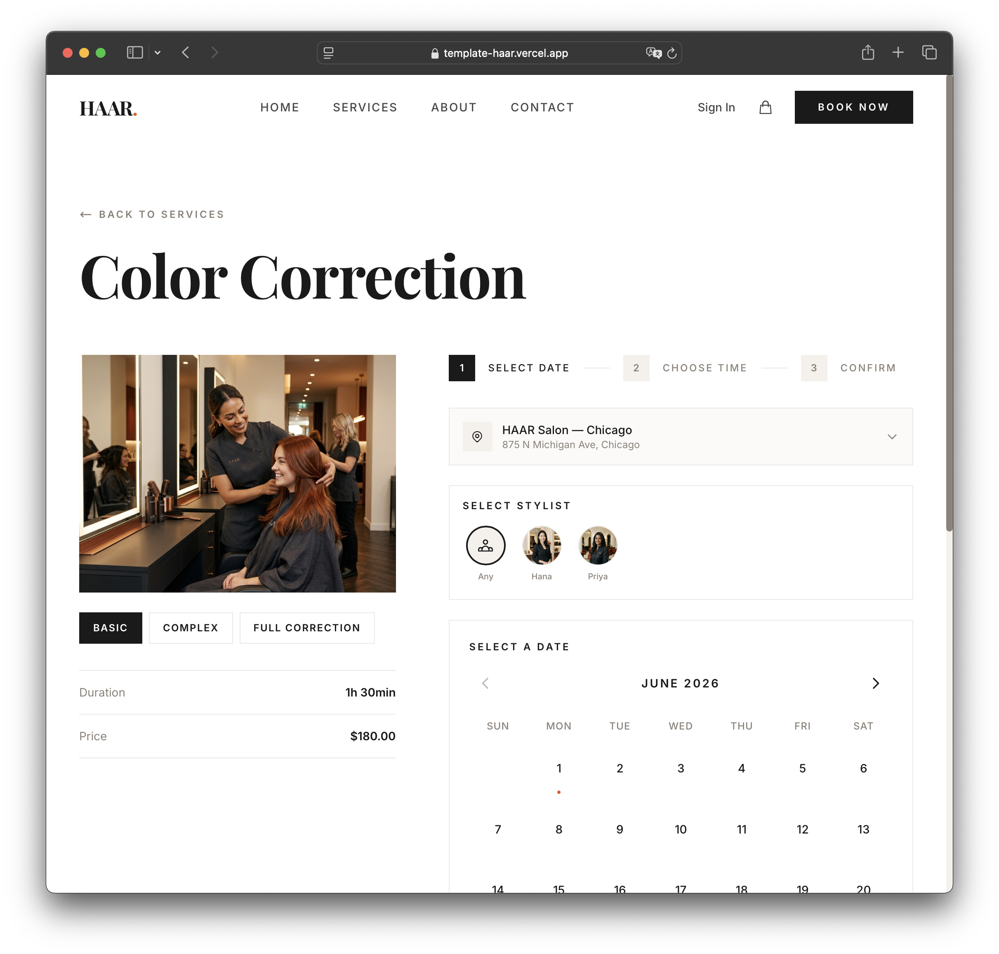
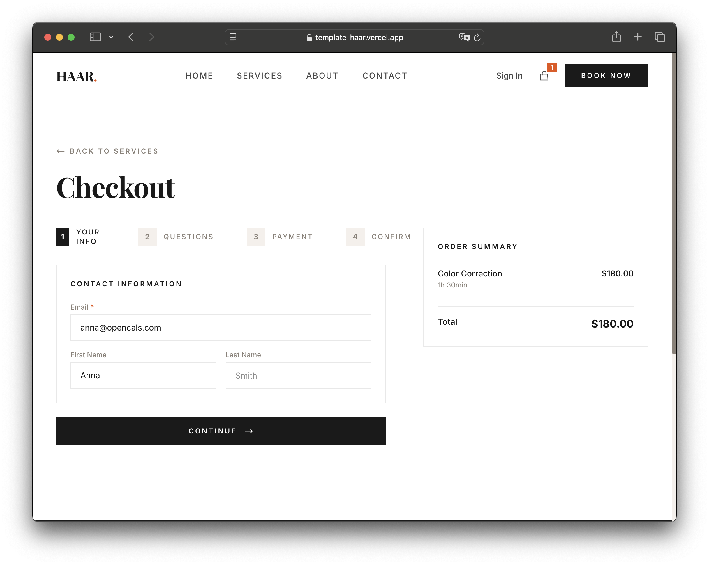

# HAAR Salon — Next.js Booking Template

A production-ready booking website for salons, spas, and service businesses. Built with **Next.js 15**, **Tailwind CSS v4**, and the **Opencals Storefront SDK**.

**[View Live Demo](https://template-haar.vercel.app/)**


---

## Get Started in 3 Steps

### 1. Create an Opencals account

Sign up at **[app.opencals.com](https://app.opencals.com)** and create a **Dev Store**. When prompted for a dataset, choose **"HAAR Salon"** — this seeds your store with sample services, staff, and locations so your template looks exactly like the demo.

### 2. Get your API key

Go to your **User Account Settings** in the Opencals dashboard and generate a **Storefront API key**. You'll need this to connect the template to your store.

### 3. Deploy to Vercel

[](https://vercel.com/new/clone?repository-url=https%3A%2F%2Fgithub.com%2Fletsopencals%2Ftemplate-haar&env=OPENCALS_API_KEY,AUTH_SECRET&envDescription=API%20key%20from%20your%20Opencals%20dashboard%20and%20a%20random%20secret%20for%20auth&envLink=https%3A%2F%2Fgithub.com%2Fopencals%2Ftemplates%2Fblob%2Fmain%2Fhaar-salon-template%2FREADME.md%23environment-variables&project-name=haar-salon&repository-name=haar-salon)

During deployment, Vercel will ask you to set environment variables:

| Variable | Value |
|----------|-------|
| `OPENCALS_API_KEY` | Your Storefront API key (starts with `sfk_`) |
| `AUTH_SECRET` | Any random string — used for session encryption |
| `NEXT_PUBLIC_STRIPE_PUBLISHABLE_KEY` | *(optional)* Your Stripe publishable key for payments |

That's it. Once deployed, you'll have the same fully functional booking site as the [live demo](https://template-haar.vercel.app/).

---

## What's Included



### Online Booking
Browse services, select staff and location, pick a time slot, and check out — all in a smooth, animated flow.

### Service Variants
Products can have multiple variants (e.g. "Haircut" with "Standard" and "Premium" options), each with their own pricing, duration, and assigned staff.

### Multi-Location Support
Global location selector in the header, staff filtered by location, and per-location availability.



### Checkout with Stripe
Multi-step checkout with customer info, custom questions, and secure payment via Stripe Elements.

### Customer Accounts
Sign in, view upcoming appointments, browse order history, manage profile settings, and reschedule or cancel appointments.

### Mobile-First Design
Fully responsive with animated mobile menu and touch-friendly booking UI.

### SEO Ready
Per-page metadata, Open Graph/Twitter cards, JSON-LD structured data, robots.txt, and sitemap.xml — all configured out of the box.

---

## Tech Stack

| Category | Technology |
|----------|-----------|
| Framework | Next.js 15 (App Router) |
| Styling | Tailwind CSS v4 |
| Animations | Framer Motion |
| Forms | react-hook-form + Zod |
| Payments | Stripe Elements (Payment Element) |
| Auth | NextAuth.js v5 |
| Dates | moment-timezone |
| API | Opencals Storefront SDK |

---

## Local Development

```bash
git clone <repository-url>
cd haar-salon-template
npm install
cp .env.example .env
```

Edit `.env` with your values:

```
OPENCALS_API_KEY=sfk_your_key_here
AUTH_SECRET=change_me_to_a_random_string
```

```bash
npm run dev
```

Open [http://localhost:3000](http://localhost:3000).

---

## Customization

### Branding & Content

All salon-specific copy is centralized in **`lib/site-config.ts`**:

- Salon name, tagline, and logo
- Homepage hero text, CTA sections, and testimonials
- About page story, team members, and values
- Contact information (address, phone, email, hours)
- Footer links and social media

Edit this single file to rebrand the entire template.

### Theme Colors

Colors are defined as CSS custom properties in **`app/globals.css`**:

```css
@theme {
  --color-accent: #E8530E;        /* Primary brand color */
  --color-cream: #F5F0EB;         /* Light background */
  --color-charcoal: #1A1A1A;      /* Dark text/backgrounds */
  --color-warm-gray: #8A8279;     /* Secondary text */
  --font-display: 'Playfair Display', Georgia, serif;
  --font-body: 'Inter', system-ui, sans-serif;
}
```

### Adding Pages

Follow the existing pattern:
1. Create `app/your-page/page.tsx` (component)
2. Create `app/your-page/layout.tsx` (metadata)
3. Add to `navLinks` in `components/layout/header.tsx`

---

## Project Structure

```
app/
  page.tsx                    # Homepage
  services/page.tsx           # Service listing with location filter
  booking/[slug]/page.tsx     # Booking page (date/time/staff picker)
  checkout/page.tsx           # Multi-step checkout
  thank-you/page.tsx          # Post-checkout confirmation
  about/page.tsx              # About page (story, values, team)
  contact/page.tsx            # Contact form + info
  account/                    # Customer dashboard (appointments, orders, settings)
  auth/                       # Sign in, sign up, forgot/reset password
  api/                        # API routes (products, availability, booking, checkout, auth)

components/
  layout/header.tsx           # Fixed header with nav, auth, cart
  layout/footer.tsx           # Footer with location/timezone selectors
  home/                       # Homepage sections (hero, CTA, gallery, testimonials)
  booking/                    # Date picker, time slots, staff/location selectors
  cart/cart-drawer.tsx         # Slide-out cart drawer
  checkout/                   # Step components (customer, questions, payment, summary)
  ui/                         # Shared UI components (form, staff-avatars)

contexts/
  cart-context.tsx             # Cart state + localStorage persistence
  checkout-context.tsx         # Checkout multi-step state machine
  location-context.tsx         # Global location selector
  timezone-context.tsx         # User timezone detection + override

hooks/
  use-api-request.ts           # Generic fetch wrapper with loading/error
  use-form-submit.ts           # Form submission with API call
  use-date-formatter.ts        # Timezone-aware date/time formatting

lib/
  site-config.ts               # All branding, copy, and content in one file
  opencals.ts                  # SDK client setup
  schemas.ts                   # Zod validation schemas
  format.ts                    # Price, duration, image formatting
  auth.ts                      # NextAuth configuration
```

## Environment Variables

| Variable | Required | Description |
|----------|----------|-------------|
| `OPENCALS_API_KEY` | Yes | Storefront API key from your Opencals dashboard |
| `AUTH_SECRET` | Yes | Random string for NextAuth session encryption |
| `NEXT_PUBLIC_STRIPE_PUBLISHABLE_KEY` | No | Stripe publishable key for payment processing |
| `OPENCALS_API_URL` | No | Override API base URL (defaults to production) |

## License

MIT
